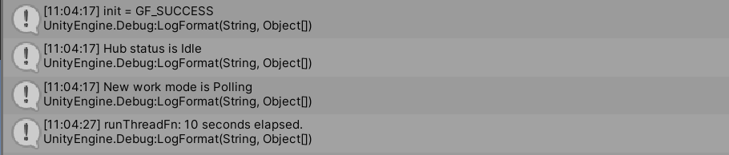

# 快速上手
本教程引导从空项目开始体验gforce。出于简化起见，只演示BuildTarget为Windows平台的情况。

请在windows平台上正确跑通流程后再自行尝试Android平台的gforce，它们的流程非常相似。
## 体验目标
* 初始化 gforcehub 与gforce dongle 连接
* 扫描设备
* 连接设备 
* 获取陀螺仪数据
## 准备环境
### 安装Unity
* 在Unity hub中安装Unity ,如果你不是经验丰富的Unity 开发者,推荐使用Unity 2019.3.1版本
* 需要有 gforce dongle 并安装对应驱动
### 安装IDE及相编译环境
* windows
  * Win 下需要安装 `Visual studio 2017`或者更高版本.安装时需要包含`使用Unity的游戏开发` 组件
  
## 初始化Unity gforce项目
从零开始构造gforce项目的过程比较冗长,项目演示可以参考[gForce-Data-Capture-Demo](https://github.com/oymotion/gForce-Data-Capture-Demo)项目
### 创建项目
创建空的Unity 3D项目
### 导入SDK
将此项目的代码和sdk放入项目中

### 创建`Main`脚本

创建 `Assets/Main.cs` 脚本类,代码如下

    
    using System.Collections;
    using System.Collections.Generic;
    using UnityEngine;
    using gf;
    using GForce;
    using GameCtrler;
    using UnityEngine.Android;
    using System.Linq;

    public class Main : MonoBehaviour
    {
        private GForceListener gForceListener;

        void Start()
        {
    #if UNITY_ANDROID && !UNITY_EDITOR
            AndroidJavaClass unityPlayerClass = new AndroidJavaClass("com.unity3d.player.UnityPlayer");
            var unityActivity = unityPlayerClass.GetStatic<AndroidJavaObject>("currentActivity");

            unityActivity.Call("runOnUiThread", new AndroidJavaRunnable(() => {
                GForceHub.instance.Prepare();
            }));

            string[] strs = new string[] {
                "android.permission.BLUETOOTH",
                "android.permission.BLUETOOTH_ADMIN",
                //"android.permission.ACCESS_COARSE_LOCATION",
                "android.permission.ACCESS_FINE_LOCATION"
            };

            strs.ToList().ForEach(s =>
            {
                Permission.RequestUserPermission(s);
                Debug.Log("add RequestUserPermission: " + s);
            });
    #else
            GForceHub.instance.Prepare();
    #endif

            gForceListener = new GForceListener();
            Hub.Instance.registerListener(gForceListener);

        }

            private void OnDestroy()
            {
                GForceHub.instance.Terminate();
            }
    }

创建主场景
* 创建默认初始场景 main.scene
* 场景中创建一个空gameObject ,将main脚本挂到上面
* 在Build Settings中添加main场景到打包场景列表

点击 unity 的播放运行按钮

  

增加存储 GForceGameController 的list

        IGameController[] IGForceGameControllerGroup = new IGameController[1];
        GForceGameController[] ctrlerGroup = new GForceGameController[1];
        List<GForceGameController> showGfroceGameCtrlerList = new List<GForceGameController>();
        GameGforceListener gameGforceListener = new GameGforceListener();

根据需要注册 GForceGameController

        gForceListener = new GForceListener();
        Hub.Instance.registerListener(gForceListener);
        gameGforceListener.initGForceListener(gForceListener);
        
        IGForceGameControllerGroup[0] = GameControllerManager.CreateGameController("GForceGameController");
        gForceListener.RegisterGForceDevice(IGForceGameControllerGroup[0] as GForceDevice);
        ctrlerGroup[0] = (GForceGameController)IGForceGameControllerGroup[0];
        showGfroceGameCtrlerList.Add(ctrlerGroup[0]);

在你需要扫描的地方加入扫描,如果你第一次使用,可以直接添加在 注册结束后

         Hub.Instance.startScan();

因为蓝牙的影响,并不是每次扫描都会扫到设备,建议是手动触发扫描,或者再他完成的时候再次开始扫描

扫描到设备的log
  

存储扫描设备

添加以下代码

    //存储扫描到的设备
    List<Device> fondDevice = new List<Device>();

    private void OnFondDevice(Device _device)
    {
        for (int i = 0; i <= fondDevice.Count; i++)
        {
            if (i == fondDevice.Count) 
            {
                fondDevice.Add(_device);
                return;
            }
            else
            {
                if (fondDevice[i].getAddress() == _device.getAddress())
                {
                    fondDevice[i] = _device;
                }
            }
        }
    }

并且在合适的地方 调用 `fondDevice[0].connect();` 连接设备,如果你第一次使用,可以写在updata中

        if (Input.GetKeyDown(KeyCode.S))
        {
            if (fondDevice.Count > 0
                && fondDevice[0] != null)
            {
                Hub.Instance.stopScan();
                fondDevice[0].connect();
            }
        }

并在`Start`中添加代码

    gameGforceListener.onFondDevice += OnFondDevice;

  

在updata中调用更新代码

        ctrlerGroup[0].Tick();

## 在UI上显示数据
*此步骤如果只是在unity中运行看log可以不做*

* 在场景中创建一个 `UI/Text`,设置好大小
* 在main 中添加引用 `using UnityEngine.UI;`和变量 `public Text DeviceText;`和`GForceGameController connectDevice;`
* 将场景的的text挂在`main`脚本

* 在`updata`函数中的连接后添加 `DeviceText.text = "连接设备:" + fondDevice[0].getName();`和`connectDevice = ctrlerGroup[0];`
* 在updata末尾加以下代码
    
        if (ctrlerGroup[0].GetEmgValue() != null)
        {
            DeviceText.text = "当前四元数数据为" + ctrlerGroup[0].GetQuaternion()
                +"当前肌电数据为" + ctrlerGroup[0].GetEmgValue()[0];
        }

## 结束

最后`main`函数中的代码如下

    using System.Collections;
    using System.Collections.Generic;
    using UnityEngine;
    using gf;
    using GForce;
    using GameCtrler;
    using UnityEngine.Android;
    using System.Linq;
    using UnityEngine.UI;

    public class Main : MonoBehaviour
    {
        private GForceListener gForceListener;

        IGameController[] IGForceGameControllerGroup = new IGameController[1];
        GForceGameController[] ctrlerGroup = new GForceGameController[1];
        List<GForceGameController> showGfroceGameCtrlerList = new List<GForceGameController>();
        GameGforceListener gameGforceListener = new GameGforceListener();

        List<Device> fondDevice = new List<Device>();

        public Text DeviceText;

        GForceGameController connectDevice;

        void Start()
        {
    #if UNITY_ANDROID && !UNITY_EDITOR
            AndroidJavaClass unityPlayerClass = new AndroidJavaClass("com.unity3d.player.UnityPlayer");
            var unityActivity = unityPlayerClass.GetStatic<AndroidJavaObject>("currentActivity");

            unityActivity.Call("runOnUiThread", new AndroidJavaRunnable(() => {
                GForceHub.instance.Prepare();
            }));

            string[] strs = new string[] {
                "android.permission.BLUETOOTH",
                "android.permission.BLUETOOTH_ADMIN",
                //"android.permission.ACCESS_COARSE_LOCATION",
                "android.permission.ACCESS_FINE_LOCATION"
            };

            strs.ToList().ForEach(s =>
            {
                Permission.RequestUserPermission(s);
                Debug.Log("add RequestUserPermission: " + s);
            });
    #else
            GForceHub.instance.Prepare();
    #endif

            gForceListener = new GForceListener();
            Hub.Instance.registerListener(gForceListener);
            gameGforceListener.initGForceListener(gForceListener);
            gameGforceListener.onFondDevice += OnFondDevice;

            IGForceGameControllerGroup[0] = GameControllerManager.CreateGameController("GForceGameController");
            gForceListener.RegisterGForceDevice(IGForceGameControllerGroup[0] as GForceDevice);
            ctrlerGroup[0] = (GForceGameController)IGForceGameControllerGroup[0];
            showGfroceGameCtrlerList.Add(ctrlerGroup[0]);

            Hub.Instance.startScan();
        }

        private void Update()
        {
            if (Input.GetKeyDown(KeyCode.A))
            {
                Hub.Instance.startScan();
            }

            if (Input.GetKeyDown(KeyCode.S))
            {
                if (fondDevice.Count > 0
                    && fondDevice[0] != null)
                {
                    Hub.Instance.stopScan();
                    fondDevice[0].connect();

                    connectDevice = ctrlerGroup[0];
                    DeviceText.text = "连接设备:" + fondDevice[0].getName();
                }
            }
            if (ctrlerGroup[0].GetEmgValue() != null)
            {
                DeviceText.text = "当前四元数数据为" + ctrlerGroup[0].GetQuaternion()
                    +"当前肌电数据为" + ctrlerGroup[0].GetEmgValue()[0];
            }
            ctrlerGroup[0].Tick();
        }

        private void OnDestroy()
        {
            GForceHub.instance.Terminate();
        }

        private void OnFondDevice(Device _device)
        {
            Debug.Log("存储扫描设备" + _device.getName());
            
            for (int i = 0; i <= fondDevice.Count; i++)
            {
                if (i == fondDevice.Count) 
                {
                    fondDevice.Add(_device);
                    return;
                }
                else
                {
                    if (fondDevice[i].getAddress() == _device.getAddress())
                    {
                        fondDevice[i] = _device;
                    }
                }
            }
        }
    }

# 问题答疑
Q: 为什么要在连接前先停止扫描?
A: 扫描回调回来的设备虽然是同一个设备,同一个地址,但是对应的内存不同,需要停止扫描取最新的扫描设备进行连接
